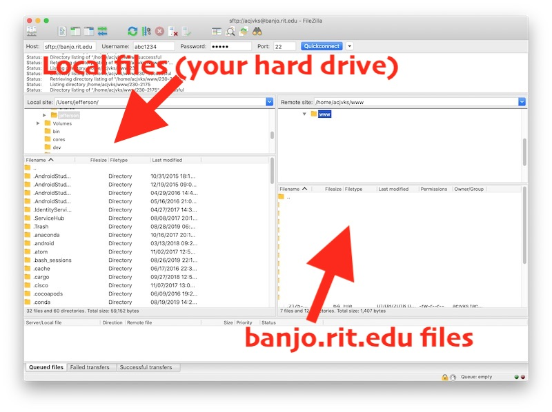
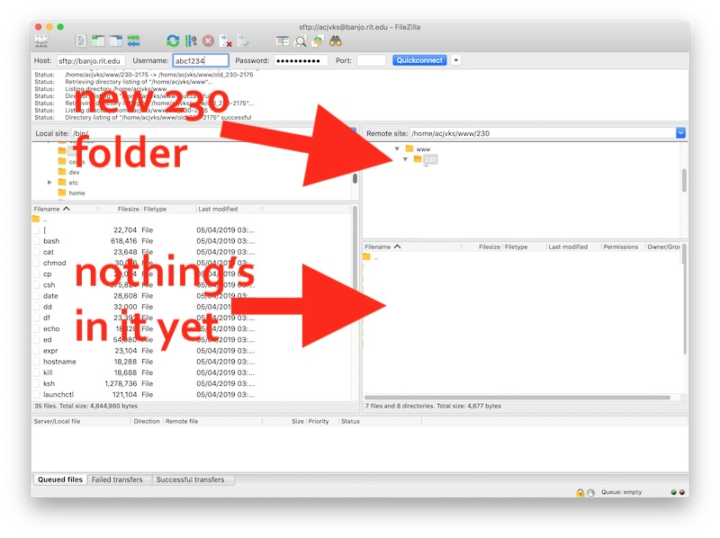
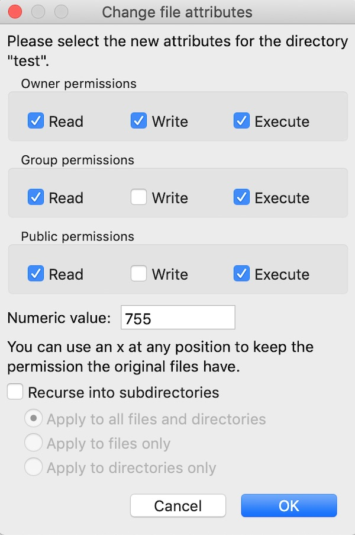

# Core Skills: FTP File Upload Walkthough

 I. [Create a Simple Web Page](#partI)
 
 II. [FTP Overview]((#partII))
 
 III. [Connect to the banjo.rit.edu server]((#partIII))


*Note: If you are in a section of IGME-110, IGME-235 or IGME-330, you can substitute all references to the number `230` below with the appropriate number for your course :-)*

<a id="partI"/>

## I. Create a Simple Web Page

1) Fire up a text editor such as NotePad++, Visual Studio Code, or Brackets and create and save the following file. NOTE: *Be sure to use **type** "plain text" or "HTML"; do NOT create web pages of type "rich text"*

**hello.html**

```html
<!DOCTYPE html>
<html lang="en">
<head>
	<meta charset="utf-8" />
	<title>Hello Page</title>
	<style>
	h1{
	  font-family:sans-serif;
	}
	
	p:first-of-type{
		font-style:italic;
	}
	</style>
</head>
   <body>
      <h1>Week 1 in 230!</h1>
      <p>We will be learning a lot this semester!</p>
      <p>Course GitHub is here: <a href="https://github.com/tonethar/IGME-230-Fall-2019">IGME-230 Fall 2019</a></p>
      <!-- 	This simple page actually has a lot going on in it! -->
      <!-- 	These are HTML comments that is not visible in the browser window -->
   </body>
</html>
```

2) Now open the page up in a web browser, it should look something like this:


<hr>

<a id="partII"/>

## II. FTP Overview

- Now that we've created and previewed our simple web page, let's put it out on the web for the whole world to see! To do that we are going to have to upload the file to a *web server*
- What is a web server? It's a computer that is connected to the Internet, that runs specialized software (ex. [Apache HTTP Server](https://en.wikipedia.org/wiki/Apache_HTTP_Server)) that stores and serves up the various files (HTML, CSS, images,JavaScript ...) that make up a web page.
- `banjo.rit.edu` is the address of the web server that hosts files for people.rit.edu, which is where your personal RIT account is located 
- **FTP** stands for **File Transfer Protocol** - which is a way of transferring files between computers that are connected on the Internet
- *Filezilla* is an *FTP client* application that makes it easy to upload and download files to and from a web server

<hr>

<a id="partIII"/>

## III. Connect to the banjo.rit.edu server

1. Fire up *Filezilla* (which is on the lab PCs) or a similar FTP client
2. FTP clients need 4 pieces of information before they can connect to a server
- the **address** of the server to connect to (for today this is ***`banjo.rit.edu`***)
- the **user id** of the account where you want to post files (your RIT ***`abc1234`*** id)
- the **password** of the account (your ***password***)
- the **port** you wish to connect to (this is ***`22`*** which is SFTP - "Secure FTP")
- now "make it so" by clicking the **Quickconnect** button!!


<hr>

## IV. Create a 230 folder

- Now that you are connected, you can see your computer's files on the left side of the screen, and the banjo.rit.edu files on the right
- Go ahead and click on the folders on the right side of the Filezilla window so that the **`www`** folder is selected
- This is what you should see:



- **Important:** Files that are going to be visible on the web *must* be placed either directly in the **`www`** folder or one of its sub-folders
- We will now create a new *directory* (aka *folder*) inside of **`www`** to put all of our course materials in. We will give this directory the highly descriptive name of **`230`**
- To accomplish this, perform the following steps:
  - With the **`www`** folder selected, go ahead and right-click and choose "Create Directory" from the pop-up menu
  - Name the new directory **`230`**
  - This is what you should see:



<hr>

## V. Set the Unix file permissions for your 230 folder

- Now we need to give the web server permission to open this folder and access a listing of the files in it - this is called setting the Unix *file permissions* of the folder. This is something that the FTP client will be able to do for us.
- Go ahead and select the **`230`** folder, right-click,  and choose "File Attributes..."
- Make the attributes of the folder match the screenshot below. These are the correct file permissions anytime you create a folder on banjo:



<hr>

## VI. Verify that your 230 folder is visible on the web

- Point a web browser at `http://people.rit.edu/~abc1234/230` (where `abc1234` is your id) - you should see an empty folder like this below. If it doesn't look right, go ahead and ask for help from a neighbor, or the TA or Prof:


 
<hr>

## VII. Post hello.html to the web

- This is easy! Head back to Filezilla. With the **`230`** folder selected, just drag the **hello.html** file to the window, and the **hello.html** file will upload automatically.
- As with the **`230`** folder, you will also need to give the web server *permission* to the files that you upload. As before, right-click and choose "File Attributes..." for **hello.html** - for files (as opposed to folders) the permissions will usually look like this:


<hr>

## VIII. Verify that your hello.html file is visible on the web

- Point a web browser at `http://people.rit.edu/~abc1234/230/hello.html` (where `abc1234` is your id) - you should see the web page!


<hr>


