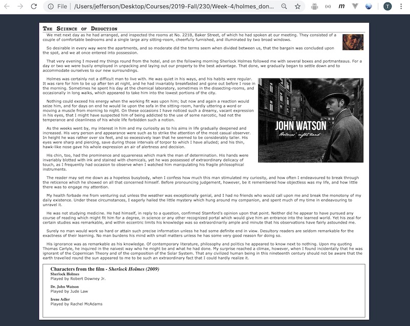

# Holmes Part II

## I. Overview

- Now we're going to style this page up so that it looks good on a typical desktop PC web browser!

## II. Instructions

1) Create a "wrapper" for the entire page (just below the opening `<body>`) that looks like this:
  - `
...page content...
`
1) Create a style rule that sets the `margin` and `padding` for the whole document to 0. (This 'reset' is often done to account for differences between browsers on how they handle margin and padding.) - use the *universal selector* - `*`
1) Create a style rule that puts vertical space *between* the paragraphs (hint: use `margin`)
1) Create a style rule that gives the `body` left and right margins of 10% of the width of the browser, and a contrasting background color
1) Create a style rule that gives `#content` a background color of white and padding around the text - now you should see the "gutter" for the page
1) Create a style rule that indents the text in the paragraphs and gives it a more pleasing font
1) Create a style rule that gives the `<h1>` tag a more appropriate and pleasing font for a headline - find a web font you like and link to it
1) Fix the actor names (just) in the movie section so that they indent a certain amount 
1) Can you improve the contrast between the movie section and the main document? Try using border, padding, margin, and/or background-color to do so
1) All styles can now go into an external style sheet named **styles.css** - in a folder named **css** use the `<link>` element to connect to it
1) Validate this stylesheet at https://jigsaw.w3.org/css-validator/
1) You are done for now - see myCourses for submission instructions

## III. Screenshot of today's version

***Here's an example - much better looking than last time, but your's could/should look a little different***

***There are many possible changes & improvements you could make***

 **[Previous Chapter <- Holmes (part 1)](holmes-part-1.md)**
