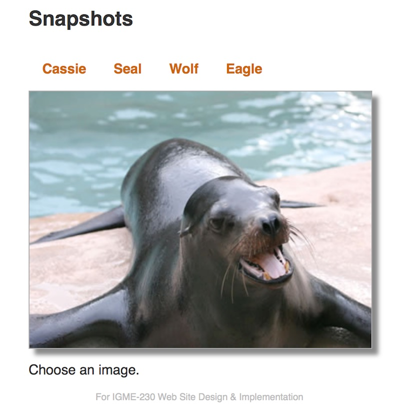

# Homework: Image Gallery

## Overview
In this assignment you will create a simple image gallery. 

To do this assignment, you should have completed at least the 6th web app tutorial page - "Events".

## Instructions
You will need to write some JavaScript to get this working:
1. The start files are here [gallery-start.zip](_files/gallery-start.zip) (use Download button)
1. Clicking on each "link" (they are actually &lt;span> tags) will load the applicable picture - use the `click` event.
1. The image name for each link is stored in a custom data attribute of the &lt;span> - we learned how to access these in [web-apps-6.md](./web-apps-6.md)
1. This exercise is a little old and needs a few fixes:  Change the title attributes of the navigation so that they make sense.  Update the footer so that it has the correct course number and name.
1. An optimal solution won't use very much code, and should not take long to write.
1. Optional: A "juiced up" image gallery that utlizes more JavaScript and showcases your mastery of advanced CSS is a possible portfolio piece. There are many ways to enhance this image gallery if you wanted to:
    1. Effects like crossfades can be done with CSS and by adding a second &lt;img> tag. Demonstrations on how to do this are here: http://css3.bradshawenterprises.com/cfimg/
    1. Adding "you are here" cues indicating which picture was selected would be nice. Adding a visible caption for each picture (to be displayed in a paragraph for example) would also be a good feature. 
    1. A more scalable solution that could display many more images would load data from arrays, and dynamically create thumbnails
    1. You could also completely redesign the layout to be responsive using Flexbox and CSS Grid.
1. When you're done, zip and upload your files to the Assignment in myCourses.

Additional note: This is not a tutorial on how to make an image gallery, per se.  There are many different, efficient, attractive, etc. ways to do so besides this.  This HW is specifically to have you work with custom data attributes.

**[Table of Contents <- About this Web App Tutorial Series](web-apps-0.md)**
