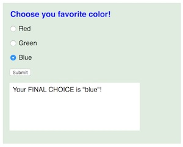

# Web Apps ICE 5

## A) Overview of *Color Chooser*


### 1) The starting code looks like this:

Create the following file, and name it **web-apps-6-HW.html**

```html
<!DOCTYPE html>
<html lang="en">
<head>
	<meta charset="utf-8" />
	<title>Web Apps-6</title>
	<style>
		body{
			font-family:sans-serif;
		}
		#colorform{
			background-color:#dfecdf;
			color: #111;
			padding:1em;width:400px;
		}
		#colorform p#info{
			background-color:white;
			color: black;
			width:300px;
			height:100px;
			padding:.5em;
		}
		
		#colorform legend{ 
			font-weight:bold;
			font-size:1.2em;
		}
	</style>
</head>
<body>

<div id="colorform">
	<legend>Choose your favorite color!</legend>
	<p><input type="radio" name="colorGroup" id="colorGroup" value="red" /> Red</p>
	<p><input type="radio" name="colorGroup" id="colorGroup" value="green" /> Green</p>
	<p><input type="radio" name="colorGroup" id="colorGroup" value="blue" /> Blue</p>
	<p><button id="colorButton" type="button">Submit</button></p>
	<p id="info"></p>
</div>

<script>
/* Write you code here! */
</script>
</body>
</html>
```

### 2) Which looks like this in the browser:

Note that because we `name` all of the radio buttons the same, they are considered a "group" by the browser, and we can only select one radio button at a time. Try it. The submit button currently does nothing.


### 3) After you have written all of your JavaScript code, and clicked a radio button ...

You should see a message indicating what color you have selected.


### 4) Once you click the Submit button ...

You should see another message about the color you selected, and the &lt;legend> element should also change to that color.



## B) Hints
1. You can use event handlers OR event listeners, it's your choice
1. You can use standard functions OR arrow functions, it's your choice
1. The **Submit button** code should be triggered by the `click` event
1. The **Radio button** code should be triggered by the `change` event
1. `document.querySelectorAll()` can be used to get reference to all of the radio buttons. You can then loop through the list you get back (use a [`for`](https://developer.mozilla.org/en-US/docs/Web/JavaScript/Reference/Statements/for) or [`for...of`](https://developer.mozilla.org/en-US/docs/Web/JavaScript/Reference/Statements/for...of) loop).
1. To get the value of the selected radio button, use `e.target.value`
1. In the submit button code, you can check to see which radio button is selected by checking its `.checked` property
1. The `value` of these radio buttons happens to be a CSS color keyword, so it will be pretty easy to assign the value to the color property of the &lt;legend> element (and CSS color values are not case sensitive, so don't worry about the capitalization).

## C) Submission
Be sure to submit this to the applicable dropbox, and do not post it to your web site.

## D) Extra Credit (worth 1 full HW)
Can you do a version of this web app, but with HTML checkboxes? Name the file **web-apps-6-HW-with-checkboxes.html**

Hint: Checkboxes have a `.checked` property.

Hint: Don't worry about changing the color of the &lt;legend> in this version.

Checkboxes allow the user to make multiple selections. Yours should work like the version below.

**Check multiple select boxes:**


**Click Submit button:**


**Submission: Post to extra credit dropbox**

<hr>
